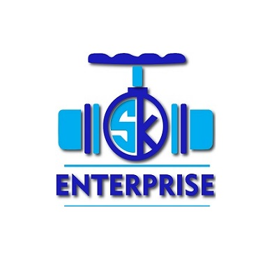

<div align="center">

</div>

# SK Enterprise — Industrial Valves & Gates

A modern web application for **SK Enterprise**, specializing in manufacturing industrial valves and gates.

---

> [!CAUTION]
>
> ## ⚠️ COPYRIGHT NOTICE — DO NOT CLONE
>
> **This repository is proprietary and protected under copyright law.**
>
> - 🚫 **DO NOT** clone, fork, copy, or download this repository.
> - 🚫 **DO NOT** use any part of this code for commercial or personal projects.
> - 🚫 **DO NOT** redistribute, modify, or create derivative works from this code.
>
> **Unauthorized use will result in a copyright strike, DMCA takedown, and strict legal action.**
>
> This repository is publicly visible for **portfolio and reference purposes only**. Public visibility does **NOT** grant any license or permission to use the code.
>
> See the [LICENSE](LICENSE) file for full terms.

---

## 🏭 About

S.K. Enterprise is a company specialized in manufacturing high-quality industrial valves and gates for various applications. Our products are designed to meet the highest standards of quality and durability, ensuring reliable performance in demanding conditions.

## 🌐 Website

Visit us at [www.skenterprize.com](https://www.skenterprize.com/)

## ✨ Features

- Modern, responsive design with Framer Motion animations
- Product catalog with detailed specifications
- Parts inventory management
- Interactive tables with sorting and pagination
- Mobile-friendly interface
- Secure online ordering and payment processing
- Customer support and technical assistance

## 🛠️ Tech Stack

- **Frontend:** React.js, React Router, Framer Motion, TanStack Table
- **Backend:** Node.js, Express, MongoDB
- **Styling:** Tailwind CSS
- **Others:** Axios, React Hook Form

## 📁 Project Structure

```
SK Enterprise/
├── Web/
│   ├── frontend/
│   │   ├── src/
│   │   │   ├── components/
│   │   │   ├── pages/
│   │   │   │   ├── home/
│   │   │   │   ├── about/
│   │   │   │   ├── contact/
│   │   │   │   └── productlist/
│   │   │   ├── hooks/
│   │   │   ├── services/
│   │   │   ├── utils/
│   │   │   └── assets/
│   │   └── public/
│   └── backend/
│       ├── controllers/
│       ├── models/
│       ├── routes/
│       └── config/
└── README.md
```

## 📞 Contact

For any inquiries or support, please contact us at:

- **Email:** skenterprise2989@gmail.com, saha.biswa2013@gmail.com
- **Phone:** +91 82966-31533, +91 97480-28331
- **Address:** Shanpur (South) Dasnagar, Howrah - 711105, West Bengal, India

**Follow us on social media:**

- [Facebook](https://www.facebook.com/share/1BNffYzjWk/)

## 📄 License

**This project is NOT open source.**

All rights reserved © 2025 Pratyush Kumar Saha. This project is protected under a **Proprietary License**. Unauthorized cloning, copying, distribution, or commercial use is strictly prohibited and will be met with legal action.

See the [LICENSE](LICENSE) file for details.
